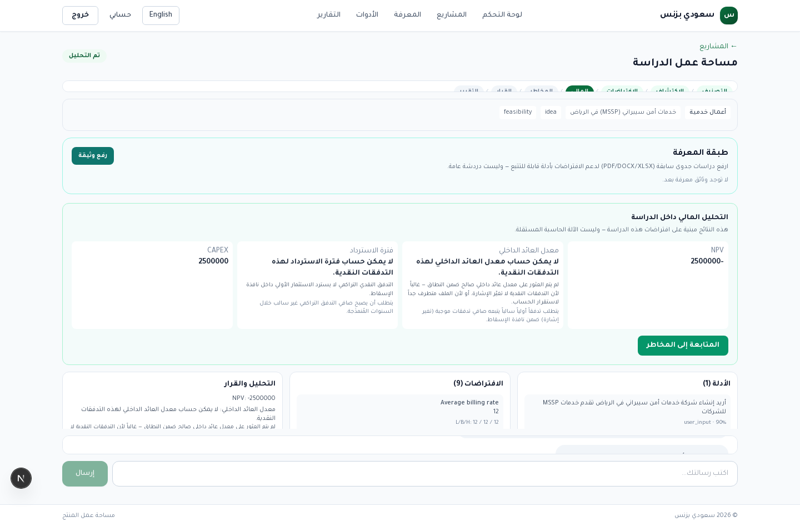
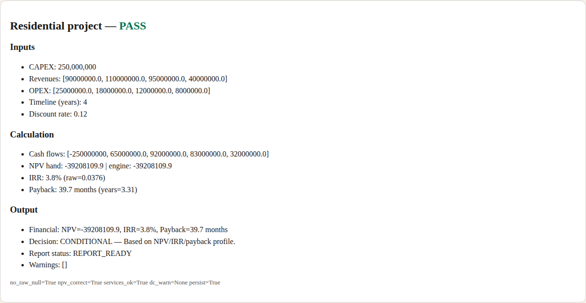
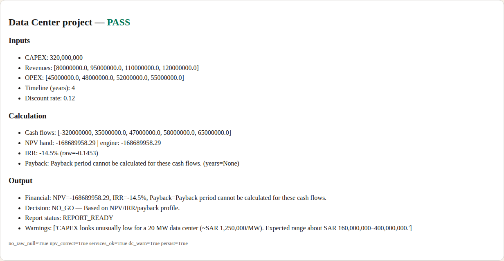
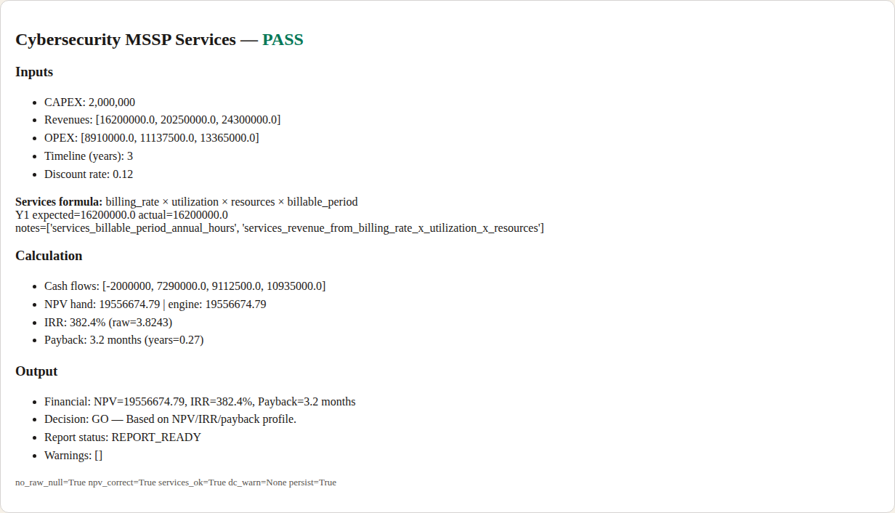
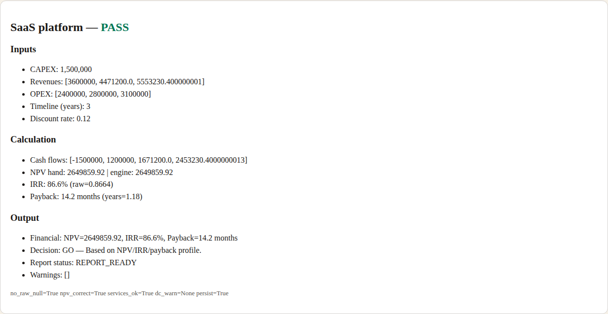
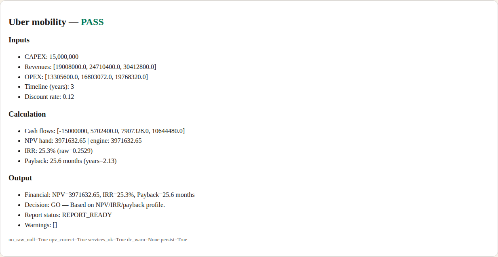
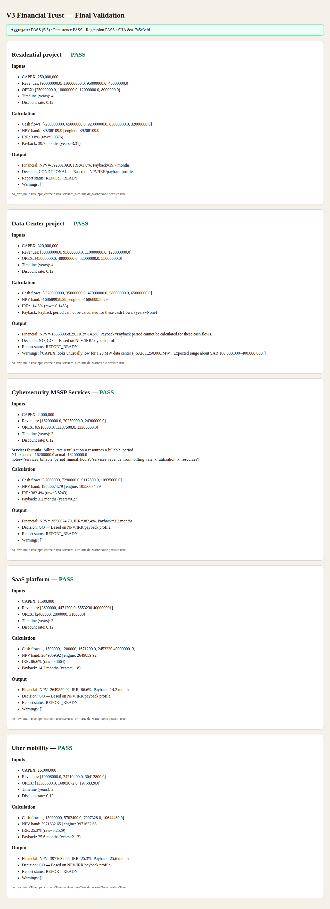

# V3 Financial Trust — Final Validation

**Aggregate: PASS (5/5)**  
**Candidate tip:** `release/v3.0.0`  
**Owner Gate:** 19/19 PASS (already validated on this candidate)  
**Regression:** financial trust unit tests PASS (16 passed)  
**Persistence:** PASS (create → save financial results → logout/login → reopen)

Evidence pack:
- `docs/evidence/v3-financial-trust-final/FINAL_VALIDATION.json`
- Scenario boards: `ft-final-*.png`
- In-study UI (no raw null): `ui-in-study-financial-no-raw-null.png`

---

## 1. Original audit issue

Owner Acceptance Gate step 10 initially failed when the financial panel rendered raw technical values:

- `Payback (months): null`
- `IRR: null` (same class of defect)

That was a **Financial Trust blocker**, not a test false-fail. End users must never see raw `null` / `UNKNOWN` for IRR or Payback.

A second trust defect was found during this final gate:

- Studies with **>3 years** of revenue/cost inputs were **silently truncated to 3 years**, producing incorrect NPV/IRR/payback versus the stated timeline.

---

## 2. Root cause

1. **Null display leak**
   - Backend stored numeric `irr` / `payback_months` as JSON `null` when not computable.
   - UI and chat interpolated those values directly (`String(null)` / f-string), so users saw the literal `null`.

2. **Incorrect NPV for multi-year studies**
   - `run_financial_analysis` normalized cash-flow series with `revenues[:3]` / `costs[:3]`.
   - Residential and Data Center candidate studies use a 4-year horizon; truncating year 4 changed NPV/IRR/payback.

---

## 3. Fix

### A. Meaningful financial states (no raw null)

Backend (`ai_engine/tools/financial_trust.py` + financial analyst):

- Always attach:
  - `irr_display` / `payback_display`
  - `irr_state` / `payback_state` with `available`, `display`, `reason`, `missing_condition`
- Chat summary uses display strings only.
- API study payload enriches financial results on read.

Frontend:

- `apps/web/lib/financialDisplay.ts` + study panels / decision panel / financial tab / tools page
- Never render bare `null`; show friendly message + reason + missing condition.

### B. Correct NPV horizon

`ai_engine/agents/financial_analyst.py`:

- Keep the **full provided horizon** (pad short series to ≥3 years; **do not truncate** longer series).
- Persist `projection_years` and full year projections.

### C. Regression coverage

- Unit tests assert display strings never contain `null`.
- New test: 4-year residential horizon keeps all cash flows and matches hand NPV.

---

## 4. Before / After

| Surface | Before | After |
|---------|--------|-------|
| Payback unavailable | `Payback (months): null` | `Payback period cannot be calculated for these cash flows.` + reason + missing condition |
| IRR unavailable | `IRR: null` | `IRR cannot be calculated for these cash flows.` + reason + missing condition |
| 4-year residential NPV | Engine used 3 years → wrong NPV | Engine uses 4 years → matches hand NPV `-39,208,109.9` |
| Chat summary | Could interpolate raw null | Uses display fields only |
| Persistence reopen | Risk of raw null on reload | Display fields survive logout/login/reopen |

**UI proof (in-study financial panel):**



---

## 5. Five scenario evidence

### 1) Residential project — PASS



| Field | Value |
|-------|-------|
| CAPEX | 250,000,000 |
| Revenues Y1–Y4 | 90M, 110M, 95M, 40M |
| OPEX Y1–Y4 | 25M, 18M, 12M, 8M |
| Timeline | 4 years |
| Discount rate | 12% |
| Cash flows | [-250M, 65M, 92M, 83M, 32M] |
| NPV hand / engine | -39,208,109.9 / -39,208,109.9 |
| IRR | 3.8% |
| Payback | 39.7 months |
| Decision | CONDITIONAL |
| Report status | ANALYZED / CONDITIONAL |
| Raw null | none |

### 2) Data Center project — PASS



| Field | Value |
|-------|-------|
| CAPEX | 320,000,000 (warning probe at 25,000,000) |
| Revenues Y1–Y4 | 80M, 95M, 110M, 120M |
| OPEX Y1–Y4 | 45M, 48M, 52M, 55M |
| Timeline | 4 years |
| Discount rate | 12% |
| Cash flows | [-320M, 35M, 47M, 58M, 65M] |
| NPV hand / engine | -168,689,958.29 / -168,689,958.29 |
| IRR | -14.5% |
| Payback | cannot be calculated (friendly state; not `null`) |
| Soft CAPEX warning (25M / 20MW) | PASS — unusually low vs expected SAR 160M–400M range |
| Decision | NO_GO |
| Raw null | none |

### 3) Cybersecurity MSSP Services — PASS



| Field | Value |
|-------|-------|
| CAPEX | 2,000,000 |
| Formula | `billing_rate × utilization × resources × billable_period` |
| Inputs | 450 × 0.75 × 25 × 1920 |
| Y1 revenue expected / actual | 16,200,000 / 16,200,000 |
| Notes | `services_revenue_from_billing_rate_x_utilization_x_resources` |
| Revenues Y1–Y3 | 16.2M, 20.25M, 24.3M |
| OPEX Y1–Y3 | 8.91M, 11.1375M, 13.365M |
| Discount rate | 12% |
| NPV hand / engine | 19,556,674.79 / 19,556,674.79 |
| IRR | 382.4% |
| Payback | 3.2 months |
| Decision | GO |
| Raw null | none |

### 4) SaaS platform — PASS



| Field | Value |
|-------|-------|
| CAPEX | 1,500,000 |
| Revenues Y1–Y3 | 3.6M, 4.4712M, 5.55323M |
| OPEX Y1–Y3 | 2.4M, 2.8M, 3.1M |
| Discount rate | 12% |
| NPV hand / engine | 2,649,859.92 / 2,649,859.92 |
| IRR | 86.6% |
| Payback | 14.2 months |
| Decision | GO |
| Raw null | none |

### 5) Uber mobility — PASS



| Field | Value |
|-------|-------|
| CAPEX | 15,000,000 |
| Drivers / take rate | 2000 / 0.22 |
| Revenues Y1–Y3 | 19.008M, 24.7104M, 30.4128M |
| OPEX Y1–Y3 | 13.3056M, 16.803072M, 19.76832M |
| Discount rate | 12% |
| NPV hand / engine | 3,971,632.65 / 3,971,632.65 |
| IRR | 25.3% |
| Payback | 25.6 months |
| Decision | GO |
| Raw null | none |

### Overview board



---

## 6. Validation checklist

| Requirement | Result |
|-------------|--------|
| No raw `IRR null` / `Payback null` / `UNKNOWN` | PASS |
| No incorrect NPV (hand vs engine) | PASS (5/5) |
| Services revenue uses billing × utilization × resources(/contracts) when present | PASS |
| Data Center unrealistic CAPEX shows warning | PASS |
| Persistence: refresh / logout / login / reopen | PASS |
| Owner Gate | 19/19 PASS |
| Unit regression | 16 passed |

---

## 7. Persistence detail

| Step | Result |
|------|--------|
| Register + login | PASS |
| Create project + study | PASS (`study_7500d57ee1d1` in latest run) |
| Save financial results with display fields | PASS |
| Re-login + GET study | PASS |
| Reopened IRR / Payback | `3.8%` / `39.7 months` (no raw null) |
| Reopened NPV | `-39208109.9` |
| Verdict retained | CONDITIONAL |

---

## 8. Regression results

```
tests/test_financial_trust_hardening.py
16 passed
```

Includes:

- IRR/payback display never contains `null`
- Chat summary never exposes raw null
- Sanitize strips raw null metric phrases
- Multi-year horizon keeps all provided cash flows / correct NPV

---

## 9. Release readiness implication

Financial Trust final gate is **PASS**.

Combined with Owner Gate **19/19 PASS**, the V3.0.0 release candidate is ready for the release PR.

**Still required before tag:** production deploy + production Owner Gate / financial smoke on production SHAs.
